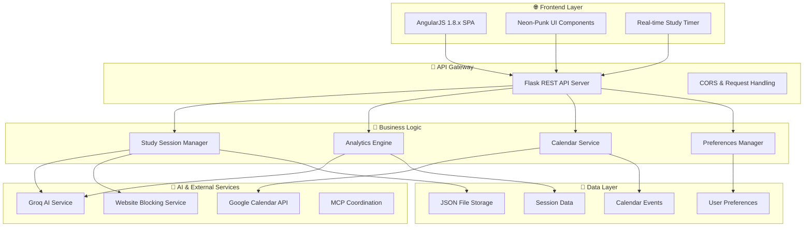

# 🧠 Smart Study Orchestrator

A **cutting-edge study management application** that combines AI-powered study planning with a stunning **neon-punk cyberpunk interface**. Built with **AngularJS 1.8.x** frontend and **Flask Python** backend, it provides real-time study session tracking, intelligent recommendations, and seamless productivity tools.

### ✨ Key Highlights
- 🤖 **AI-Powered Study Plans** using Groq LLM
- ⏱️ **Real-time Study Timers** with progress tracking
- 🚫 **Website Blocking** during study sessions
- 📅 **Google Calendar Integration** 
- 📊 **Advanced Analytics** with visual insights
- 🎯 **Goal Tracking** and achievement system
- 🎨 **Neon-Punk Theme** with glowing effects and animations

---

## 🏗️ System Architecture

### Backend Architecture Flow



### 🔗 Frontend-Backend Connection Flow

```
📱 User Interface (AngularJS)
    ↓
🔌 API Service ($http)
    ↓
🌐 HTTP Requests (REST API)
    ↓
🐍 Flask Route Handlers
    ↓
⚙️ Business Logic Services
    ↓
🤖 External AI/MCP Services
    ↓
💾 Data Persistence (JSON)
    ↓
📊 Response with Results
    ↓
🎨 UI Updates with Animations
```

---

## 🚀 Features & Capabilities


### 📊 **Dashboard**
- 🏠 System status overview
- 📈 Quick study statistics
- 🎯 Weekly progress tracking
- 🤖 AI recommendations panel
- ⚡ Quick start study sessions

### 📚 **Study Sessions**
- ⏱️ Real-time study timer with neon effects
- 🎯 Goal setting and tracking
- 🧠 AI-generated study plans
- ⏸️ Pause/resume functionality
- 🚫 Automatic website blocking

### 📈 **Analytics & Insights**
- 📊 Interactive neon-styled charts
- 🧠 Focus score tracking
- 📅 Weekly/monthly views
- 🤖 AI-powered recommendations
- 📤 Data export capabilities


### 📅 **Calendar Management**
- 🗓️ Visual calendar interface
- ➕ Create/edit/delete events
- 🔄 Google Calendar sync
- ⏰ Study break scheduling
- 📱 Responsive calendar view

### ⚙️ **Preferences & Settings**
- 🎨 Theme customization
- ⏱️ Default duration settings
- 🚫 Website blocking lists
- 💾 Data import/export
- 🔧 User preferences

### 🛠️ **System Tools**
- 🏥 Health check diagnostics
- 🧪 Backend testing suite
- 🚫 Manual website blocking
- 📋 System log exports
- 🔄 Service management


---

## 🎨 AngularJS Frontend Architecture

### 📁 Project Structure
```
frontend/
├── 📄 index.html                 # Main SPA entry point
├── 📁 app/
│   ├── 🎯 app.js                 # Main module & routing config
│   ├── 📁 controllers/           # Page controllers
│   │   ├── 🏠 dashboard.controller.js
│   │   ├── 📚 sessions.controller.js
│   │   ├── 📊 analytics.controller.js
│   │   ├── 📅 calendar.controller.js
│   │   ├── ⚙️ preferences.controller.js
│   │   └── 🛠️ tools.controller.js
│   ├── 📁 services/              # API & utility services
│   │   ├── 🔌 api.service.js     # Backend communication
│   │   └── 🔔 notification.service.js
│   ├── 📁 directives/            # Custom directives
│   │   └── 🎨 neon-components.directive.js
│   └── 📁 views/                 # HTML templates
│       ├── 🏠 dashboard.html
│       ├── 📚 sessions.html
│       ├── 📊 analytics.html
│       ├── 📅 calendar.html
│       ├── ⚙️ preferences.html
│       └── 🛠️ tools.html
├── 📁 assets/
│   ├── 🎨 css/
│   │   ├── 💫 neon-punk.css     # Main theme
│   │   └── ✨ animations.css    # Animations
│   └── 📁 js/vendor/            # External libraries
└── 📄 package.json
```

### 🔧 Technical Implementation

#### **AngularJS Module Configuration**
```javascript
angular.module('studyOrchestratorApp', ['ngRoute', 'ngAnimate'])
.config(['$routeProvider', function($routeProvider) {
    // Route configuration for SPA navigation
    $routeProvider
        .when('/dashboard', { templateUrl: 'app/views/dashboard.html', controller: 'DashboardController' })
        .when('/sessions', { templateUrl: 'app/views/sessions.html', controller: 'SessionsController' })
        // ... other routes
        .otherwise({ redirectTo: '/dashboard' });
}]);
```

#### **API Service Pattern**
```javascript
.service('ApiService', ['$http', function($http) {
    var baseUrl = 'http://localhost:5000/api';
    
    return {
        getStudySessions: function() {
            return $http.get(baseUrl + '/study/sessions');
        },
        createStudySession: function(sessionData) {
            return $http.post(baseUrl + '/study/session', sessionData);
        }
        // ... other API methods
    };
}]);
```

#### **Controller Pattern**
```javascript
.controller('SessionsController', ['$scope', 'ApiService', 'NotificationService',
function($scope, ApiService, NotificationService) {
    $scope.sessions = [];
    $scope.activeSession = null;
    
    $scope.loadSessions = function() {
        ApiService.getStudySessions().then(function(response) {
            $scope.sessions = response.data;
        });
    };
    
    // ... controller logic
}]);
```

---

## 🐍 Flask Backend Architecture

### 🏗️ Backend Structure
```
backend/
├── 🚀 run.py                    # Application entry point
├── 📁 app/
│   ├── 🎯 __init__.py           # Flask app factory
│   ├── 📁 routes/               # API endpoints
│   │   ├── 📚 study_routes.py   # Study session APIs
│   │   ├── 📅 calendar_routes.py # Calendar APIs
│   │   ├── ⚙️ preferences_routes.py
│   │   └── 🛠️ tools_routes.py
│   └── 📁 services/             # Business logic
│       ├── 🤖 groq_service.py   # AI integration
│       ├── 🔗 mcp_service.py    # Multi-agent coordination
│       ├── 📅 calendar_service.py # Google Calendar
│       └── 🚫 blocking_service.py # Website blocking
├── 📁 data/                     # JSON data storage
└── 📄 requirements.txt
```

### ⚙️ Core Services

#### **🤖 AI Integration (Groq)**
- **Study Plan Generation**: AI creates personalized study schedules
- **Analytics Insights**: Intelligent recommendations based on patterns
- **Focus Optimization**: AI suggests best study times and techniques

#### **🔗 MCP (Multi-agent Coordination)**
- **Calendar Management**: Automated event scheduling
- **Website Blocking**: System-level distraction prevention
- **File Operations**: Data persistence and management

#### **📅 Google Calendar API**
- **Real-time Sync**: Two-way calendar synchronization
- **Event Management**: Create, update, delete calendar events
- **Study Planning**: Integrate study sessions with calendar

---

## 🎨 Neon-Punk Design System

### 🌈 Color Palette
```css
:root {
    --neon-blue: #00f3ff;      /* Primary accent */
    --neon-green: #39ff14;     /* Success states */
    --neon-pink: #ff006e;      /* Highlights */
    --neon-purple: #bf00ff;    /* Secondary accent */
    --neon-orange: #ff9500;    /* Warnings */
    --neon-cyan: #00ffff;      /* Info states */
    --dark-bg: #0a0a0f;        /* Primary background */
    --dark-secondary: #1a1a2e; /* Card backgrounds */
}
```

### ✨ Visual Effects
- **Glowing Borders**: CSS box-shadow with neon colors
- **Pulse Animations**: Keyframe animations for active elements
- **Glass Morphism**: Backdrop blur effects on cards
- **Hover Transformations**: Scale and glow on interaction
- **Particle Effects**: Subtle background animations

### 🎭 Typography
- **Primary Font**: Orbitron (futuristic, tech-style)
- **Secondary Font**: Rajdhani (clean, modern)
- **Code Font**: Courier New (monospace for data)

---

## 🚀 Getting Started

### 📋 Prerequisites
- Python 3.8+
- Node.js (for serving frontend)
- Google Calendar API credentials (optional)
- Groq API key (optional)

### ⚡ Quick Setup

#### 1️⃣ Backend Setup
```bash
# Clone and navigate to backend
cd backend

# Install dependencies
pip install -r requirements.txt

# Set environment variables (optional)
export GROQ_API_KEY="your_groq_api_key"

# Run backend server
python run.py
```

#### 2️⃣ Frontend Setup
```bash
# Navigate to frontend
cd frontend

# Serve frontend (Python method)
python -m http.server 8080

# Or using Node.js
npx serve -p 8080
```

#### 3️⃣ Access Application
- 🌐 **Frontend**: http://localhost:8080
- 🔌 **Backend API**: http://localhost:5000
- 📋 **Health Check**: http://localhost:5000/health

---

## 🎯 How to Use

### 📚 Creating Study Sessions
1. Navigate to **Sessions** page
2. Click **"New Session"** button
3. Fill in subject, duration, and goals
4. Enable website blocking if desired
5. Click **"Create Session"** and start studying!

### 📊 Viewing Analytics
1. Go to **Analytics** page
2. View weekly statistics and trends
3. Check AI recommendations
4. Export data for further analysis

### 📅 Managing Calendar
1. Open **Calendar** page
2. View monthly calendar grid
3. Click on dates to create events
4. Sync with Google Calendar

### ⚙️ Configuring Preferences
1. Access **Settings** page
2. Adjust default durations
3. Manage blocked websites list
4. Export/import preferences

### 🛠️ System Diagnostics
1. Visit **Tools** page
2. Run health checks
3. Test website blocking
4. View system status

---

## 🔧 Technical Deep Dive

### AngularJS Implementation Details

#### **Single Page Application (SPA)**
- Uses `ngRoute` for client-side routing
- Hash-based navigation (`#!/dashboard`)
- Template caching for performance

#### **Data Binding & Scope Management**
- Two-way data binding for form inputs
- Scope inheritance in nested controllers
- `$apply()` for async operations

#### **Custom Directives**
```javascript
.directive('neonTimer', function() {
    return {
        restrict: 'E',
        scope: { timeRemaining: '=', isActive: '=' },
        template: '{{formatTime(timeRemaining)}}',
        link: function(scope, element, attrs) {
            scope.formatTime = function(seconds) {
                // Timer formatting logic
            };
        }
    };
});
```

#### **Service Architecture**
- Singleton services for data sharing
- Promise-based API communication
- Error handling with notifications

### Backend Flask Implementation

#### **RESTful API Design**
```python
@app.route('/api/study/session', methods=['POST'])
def create_study_session():
    data = request.get_json()
    session = {
        'id': str(uuid.uuid4()),
        'subject': data['subject'],
        'duration_minutes': data['duration'],
        'goals': data['goals'],
        'created_at': datetime.now().isoformat()
    }
    # Save and return session
    return jsonify(session), 201
```

#### **Async Service Integration**
```python
async def generate_ai_study_plan(subject, duration, goals):
    groq_service = GroqService()
    plan = await groq_service.create_study_plan({
        'subject': subject,
        'duration': duration,
        'goals': goals
    })
    return plan
```

---

## 📱 Responsive Design

### 🖥️ Desktop (1200px+)
- Full sidebar navigation
- Multi-column layouts
- Large timer displays
- Detailed charts and graphs

### 📱 Tablet (768px - 1199px)
- Collapsible sidebar
- Two-column grids
- Touch-friendly buttons
- Optimized chart sizes

### 📱 Mobile (

### 🌟 Star this repository if you found it helpful!

**Made with ❤️ for AngularJS enthusiasts and productivity lovers**


---
